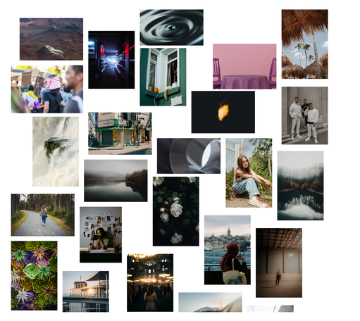

<p align="center">
  <a href="https://nickadamson.github.io/messonry/?path=/story/example-messonry--default">
    <h1 align="center">messonry</h1>
  </a>
  <p align="center">
    <a aria-label="License" href="LICENSE">
      
    </a>
    <a aria-label="NPM version" href="https://www.npmjs.com/package/messonry">
      
    </a>
    <a aria-label="Bundlephobia Minzipped Size" href="https://bundlephobia.com/package/messonry@latest">
      
    </a>
    <a aria-label="Standard README Compliant" href="https://github.com/RichardLitt/standard-readme">
      
    </a>
  </p>
  <h2 align="center">
    A messy grid layout library for React.
  </h2>
</p>

<p align="center">
  <picture>
    <a aria-label="Link to screenshot of webpage using messonry layou" href="https://github.com/nickadamson/messonry/blob/main/preview.png">
      
    </a>
  </picture>
  <br />
    Like a masonry layout; 
    <br />
    except that it displays media at its intended aspect ratio.
</p>

---

## Warning

### I'd like to release v1.0.0 with full support of Next v13.

## Consider the API experimental after messonry@0.2.0.

### Using the 'next' branch until stable release. Appreciate your understanding.

---

## Table of Contents

- [Install](#install)
- [Usage](#usage) <!-- - [API](#api) -->
- [Maintainers](#maintainers)
- [Contributing](#contributing)
- [License](#license)

## Install with package manager of your choice

```
pnpm add messonry
```

```
yarn add messonry
```

```
npm i messonry
```

## Usage

```

import MessonryGrid from "messonry";


const MyMessyLandingPage = () => {
    const myMediaArray = [
        { src: 'https://url-of-image.com/', mimeType: "image", alt: "description of image" },
        { src: 'https://url-of-video.com/', mimeType: "video", alt: "description of video" },
        { content: <MyCustomComponent /> }
    ]

    const gridOptions = {
      useNextImage={true},
       nextImageConfig: {
        quality: 90,
        priority: true,
        loading: "eager",
        unoptimized: false,
      },
    }

    return (
        <>
            <MessonryGrid items={media} options={gridOptions} />
        </>
    )

}

```

<!-- ## API -->
<!-- TODO -->

## Maintainers

[@nickadamson](https://github.com/nickadamson)

## Contributing

<!-- TODO See [the contributing file](CONTRIBUTING.md)! -->

PRs accepted.

Small note: If editing the README, please conform to the
[standard-readme](https://github.com/RichardLitt/standard-readme) specification.

## License

[MIT © 2022 Nick Adamson](../LICENSE)
